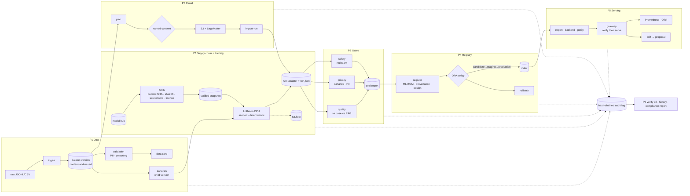

# Architecture

Lineage is one Python package (`src/lineage`) driven by one CLI (`lineage`), operating
on one *workspace*: a directory with a `lineage.toml` and a `.lineage/` state directory.
Every stage reads the evidence the previous stage left, re-verifies it, decides, and
writes its own evidence plus one entry in the shared audit log.

## Modules

| module | responsibility | depends on PyTorch |
|---|---|---|
| `hashing`, `audit`, `workspace` | canonical hashing, the hash-chained log, paths and config | no |
| `data/` | store, PII scanner, poisoning checks, validation, data card, canaries | no |
| `supply/` | weight policy and pickle scanner, licence table, base-model pin and fetch, ML-BOM | no |
| `train/` | config hash, environment capture, LoRA loop, MLflow tracking | yes |
| `evaluate/` | predictor, BM25 retrieval, privacy and safety tests, gate decisions | yes |
| `registry/` | registry store, cosign signer, registration/approval/promotion/rollback | no (export: yes) |
| `policy/` | the Rego promotion policy and its tests | — |
| `serve/` | export, backends (Ollama, vLLM), gateway, drift | export only |
| `cloud/` | consent gate, AWS calls, run import | no |
| `report/` | deep verification, history, compliance report | no |

The governance half (data, supply chain, registry, policy, cloud, reports) runs without
PyTorch: an auditor can verify a workspace on a laptop with `pip install lineage-mlops`.

## Identities

Everything is named by content, so a name can be checked:

| thing | identity |
|---|---|
| record | SHA-256 of canonical `{input, output}` (metadata excluded) |
| dataset version | `ds-` + SHA-256 over every split's ordered record hashes |
| validation report | SHA-256 of the report body |
| base model | `repo@40-char-commit` + SHA-256 per file |
| experiment | config hash: hyperparameters, dataset, base model, task, dependency lock |
| adapter | SHA-256 per file; one digest over the file map |
| registry version | `name:n`, with a signed `manifest.json` listing every file's SHA-256 |
| deployment | backend digest (Ollama) or export directory hashes (vLLM) |
| cloud plan | `plan-` + SHA-256 of what would leave the machine |
| audit entry | SHA-256 of the entry including the previous entry's hash |

## The audit log

`.lineage/audit/log.jsonl`, one JSON object per line:
`{seq, ts, actor, event, subjects, payload, prev, hash}`. `subjects` names what the entry
is about (`dataset`, `run`, `model`, `base_model`, `plan`); `history` follows those
links. Appends take an exclusive file lock, so concurrent writers cannot fork the chain.

A chain detects edits, deletions, insertions and reordering. It cannot, alone, detect
that its tail was cut. Two mechanisms cover that: each signed registry manifest embeds
the audit head at signing time (`verify all` checks those heads are still in the chain),
and `lineage audit head` prints the current head so it can be published elsewhere and
checked later with `verify all --anchor`.

## Decisions and where they are made

| decision | where | fails |
|---|---|---|
| may this dataset be trained on? | `data.service.require_trainable` | closed (validation report + acknowledgement) |
| may this base model be used? | `supply.models.fetch` / `verify_snapshot` | closed (pin, hashes, weight policy, licence) |
| did the model pass? | `evaluate.gates` (thresholds in `[gates.*]`) | report records failures |
| may it change stage? | `policy/promotion.rego` via `opa eval` | closed (no OPA, no promotion) |
| may it be served? | `serve.gateway.Live` | closed (HTTP 503) |
| may data leave? | `cloud.consent.check` | closed (no consent, no call) |

Python gathers *fresh* evidence (re-hashing, re-verifying signatures) and hands it to
the decision; it never trusts a flag written earlier.

## Why these choices

- **Standard library core.** The parts that make decisions are small and auditable;
  heavy dependencies are confined to the stages that need them.
- **A custom training loop instead of `transformers.Trainer`.** Fewer moving parts, and
  every source of nondeterminism is visible: the result is bit-for-bit reproducible.
- **OPA for promotion.** Promotion rules are reviewed like code, tested with `opa test`,
  and the policy hash is logged with every decision.
- **cosign rather than a custom signature scheme.** Standard tooling, keyless in CI with
  the workflow identity, offline with a key pair elsewhere.
- **Rule-based red-team detectors.** Deterministic and explainable; an LLM judge would
  add a second model to trust.
- **The gateway is deliberately small** (standard library HTTP server). It is a
  reference for *what* to verify before serving; a production deployment would put the
  same checks in front of a hardened server.
